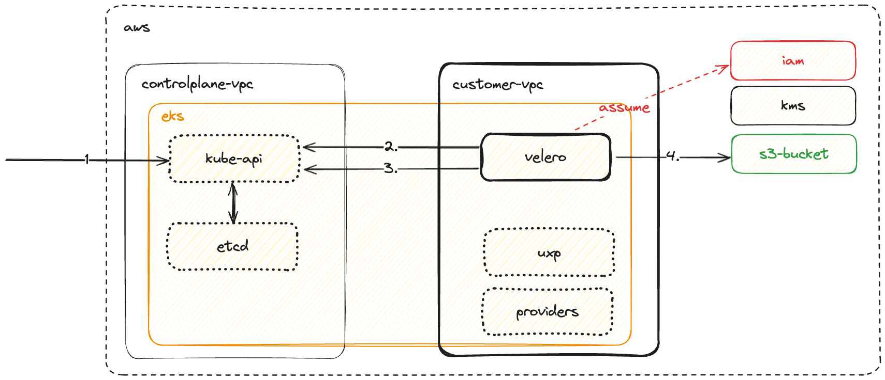

# Backup Controller base configuration

This repository offers a configuration for a Backup Mechanism with Velero.

[Velero](https://velero.io/) is a widely used open-source solution in the Kubernetes ecosystem for performing backup and restore operations on Kubernetes cluster resources. It is strongly recommended to incorporate Velero into any disaster recovery plan for your Crossplane control planes. This guide provides best practices for using Velero in the context of Crossplane.

[Disaster Recovery When Using Crossplane for Infrastructure Provision on AWS](https://aws.amazon.com/blogs/opensource/disaster-recovery-when-using-crossplane-for-infrastructure-provisioning-on-aws/) in this blog post, we discuss different backup considerations when employing GitOps and the use of Kubernetes-native infrastructure provisioning tools on Amazon Elastic Kubernetes Service (Amazon EKS).

## In the Context of Crossplane

It's important to understand that disaster recovery for Crossplane does not equate to disaster recovery for your business-critical state, such as database or cloud storage data. Here are key points to keep in mind:

1. Crossplane ensures the configuration of your resources.
2. Crossplane does not concern itself with the internal state of your resources.

Crossplane enforces two primary aspects:

1. Ensuring that the declared resources exist.
2. Ensuring that the configuration of those resources matches what you declared. If there is a mismatch, Crossplane attempts to reconcile it to the desired state.

Crossplane does not delve into the internal state of the resource.

Likewise, if your control plane fails and goes offline, it does not necessarily mean that the resources managed by that control plane also fail. It simply means that the configuration of those resources stops reconciling while the control plane is offline, which could result in configuration drift.

It is advisable to configure Velero to store captured backup states for all your control planes in a single global bucket or blob.

For each control plane you create, this configuration creates three Velero schedules with the following intervals:

- Hourly
- Daily
- Monthly

You can adjust the backup frequency based on your platform's Recovery Point Objective (RPO). If you need to restore state more frequently, you must take more frequent snapshots.

## Backup and restore workflow
### Backup
Velero consists of two components:

- A Velero server pod that runs in your Amazon EKS cluster
- A command-line client (Velero CLI) that runs locally

Whenever we issue a backup against an Amazon EKS cluster, Velero performs a backup of cluster resources in the following way:

1. The Velero CLI makes a call to the Kubernetes API server to create a backup CRD object.
2. Checks the scope of the backup CRD object, namely if we set filters.
3. Queries the API server for the resources that need a backup.
4. Compresses the retrieved Kubernetes objects into a .tar file and saves it in Amazon S3.



### Restore

To restore the backup state into a new cluster, follow these steps:

1. Ensure that Crossplane and providers are not running in the new cluster. Otherwise, the order of managed resources, composites, and claims becomes critical. Failure to do this may result in race conditions and, for example, duplication of managed resources.
2. Install Velero and configure it to use the backup data source.
3. Restore the backed-up resources to the new cluster.
4. Scale up crossplane and provider deployments to one in the new cluster.
5. During the backup and restoration process, Velero preserves owner references, resource states, and external names of managed resources. The reconciliation process should proceed as if there were no changes.

Similarly, whenever we issue a restore operation:

1. The Velero CLI makes a call to Kubernetes API server to create a restore CRD that will restore from an existing backup.
2. Validates the restore CRD object.
3. Makes a call to Amazon S3 to retrieve backup files.
4. Initiates restore operation.


## Walkthrough

### Prerequisites

To set up Velero, make sure you have the following prerequisites in place:

1. Ensure you have a Crossplane control plane running.
2. Set up an Amazon EKS cluster.
3. Ensure you can connect to the EKS cluster using a Provider Helm with the corresponding ProviderConfig.

Once these prerequisites are met, you can proceed with the following steps to install Velero:

1. Apply the configuration by running the following command:
   
   ```
   kubectl apply -f examples/configuration.yaml
   ```

2. Apply the backup configuration by running the following command:

   ```
   kubectl apply -f backup.yaml
   ```

These steps will help you bring up Velero and configure it for your environment.

### Install the Velero CLI

Installation instructions vary depending on your operating system. Follow the instructions to install Velero [here](https://velero.io/docs/v1.6/basic-install/#install-the-cli)

### Create Manual Backup

Create a backup of the crossplane controlplane. Be sure your
kubectl context is set to the crossplane controlplane before
running the command below.

Triggering a backup as shown below may include items
that will already exist on the cluster where the backup will be
restored. These items can be skipped during restore. Consult the
[Velero backup reference documentation](https://velero.io/docs/v1.12/resource-filtering/#--exclude-resources)
for available inclusion and exclusion options.
Crossplane managed resources are cluster scoped. Indicating
the `--include-cluster-resources=true` will ensure their
inclusion in the backup.

```bash
velero backup create uxp-backup --include-cluster-resources=true
Backup request "uxp-backup" submitted successfully.
Run `velero backup describe uxp-backup` or `velero backup logs uxp-backup` for more details.
```

Let’s check on the status of the backup and validate that the backup has been completed successfully.

Look for the field `Phase`: in the output of the command. If the current `Phase` is `InProgress`, then wait a few moments and try again until you see the `Phase`: `Completed`. You can see additional details of the backup, including information such as the start time and completion time, along with the number of items backed up.

```bash
velero backup describe uxp-backup

Name:         uxp-backup
Namespace:    velero
Labels:       velero.io/storage-location=velero-backup-default
Annotations:  velero.io/source-cluster-k8s-gitversion=v1.27.8-eks-8cb36c9
              velero.io/source-cluster-k8s-major-version=1
              velero.io/source-cluster-k8s-minor-version=27+

Phase:  Completed


Namespaces:
  Included:  *
  Excluded:  <none>

Resources:
  Included:        *
  Excluded:        <none>
  Cluster-scoped:  included

Label selector:  <none>

Storage Location:  velero-backup-default

Velero-Native Snapshot PVs:  auto

TTL:  720h0m0s

CSISnapshotTimeout:    10m0s
ItemOperationTimeout:  1h0m0s

Hooks:  <none>

Backup Format Version:  1.1.0

Started:    2023-12-15 23:28:27 +0100 CET
Completed:  2023-12-15 23:28:35 +0100 CET

Expiration:  2024-01-14 23:28:26 +0100 CET

Total items to be backed up:  648
Items backed up:              648

Velero-Native Snapshots: <none included>
```

We can also see the backup files created by Velero in the Amazon S3 bucket we previously created:

```bash
aws s3 ls s3-velero-service-configuration-aws-eks-velero/backups/uxp-backup/
[...]
2023-12-15 23:28:36         29 uxp-backup-csi-volumesnapshotclasses.json.gz
2023-12-15 23:28:36         29 uxp-backup-csi-volumesnapshotcontents.json.gz
2023-12-15 23:28:35         29 uxp-backup-csi-volumesnapshots.json.gz
2023-12-15 23:28:35         27 uxp-backup-itemoperations.json.gz
2023-12-15 23:28:35      20991 uxp-backup-logs.gz
2023-12-15 23:28:35         29 uxp-backup-podvolumebackups.json.gz
2023-12-15 23:28:35       4733 uxp-backup-resource-list.json.gz
2023-12-15 23:28:36         49 uxp-backup-results.gz
2023-12-15 23:28:35         29 uxp-backup-volumesnapshots.json.gz
[...]
2023-12-15 23:28:35     305615 uxp-backup.tar.gz
2023-12-15 23:28:36       2905 velero-backup.json
```
### Create manual Restore

Use the following command to restore only the upbound-system namespace - Note:
this will not include cluster scoped resources like XRDs, Compositions
unless specified.

```bash
velero restore create uxp-restore \
    --from-backup uxp-backup \
    --include-namespaces upbound-system,default \
    --include-cluster-resources
Restore request "uxp-restore" submitted successfully.
Run `velero restore describe uxp-restore` or `velero restore logs uxp-restore` for more details.
```

When backups include items that exist on the restore cluster
there is an option to specify `--existing-resource-policy none`
for the restore command to skip them. Consult the
[Velero restore reference](https://velero.io/docs/v1.12/restore-reference/)
for more information.

#### Validate the restore was successful
Let’s check on the status of the restore and validate that the restore has been completed successfully.

Look for `Phase`: `Completed` in the output. If you see `Phase`: `InProgress`, then wait a few moments and run the command again. 

```bash
velero restore describe uxp-restore
Name:         uxp-restore
Namespace:    velero
Labels:       <none>
Annotations:  <none>

Phase:                       Completed
Total items to be restored:  18
Items restored:              18

Started:    2023-12-15 23:32:38 +0100 CET
Completed:  2023-12-15 23:32:40 +0100 CET

Warnings:
  Velero:     <none>
  Cluster:    <none>
  Namespaces:
    upbound-system:  *

Backup:  uxp-backup

Namespaces:
  Included:  upbound-system, default
  Excluded:  <none>

Resources:
  Included:        *
  Excluded:        nodes, events, events.events.k8s.io, backups.velero.io, restores.velero.io, resticrepositories.velero.io, csinodes.storage.k8s.io, volumeattachments.storage.k8s.io, backuprepositories.velero.io
  Cluster-scoped:  included

Namespace mappings:  <none>

Label selector:  <none>

Restore PVs:  auto

Existing Resource Policy:   <none>
ItemOperationTimeout:       1h0m0s

Preserve Service NodePorts:  auto
```
